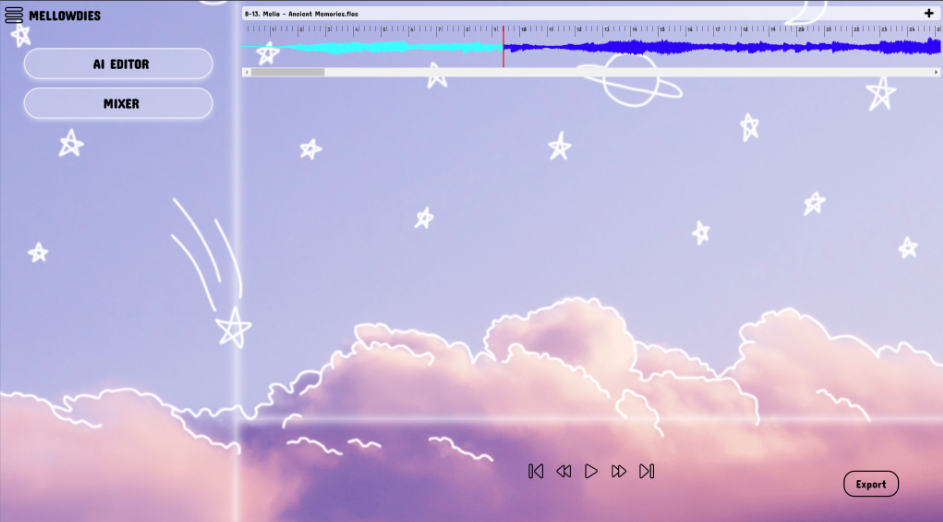
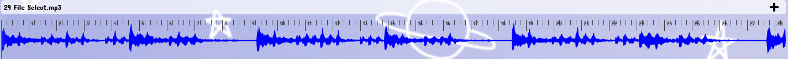
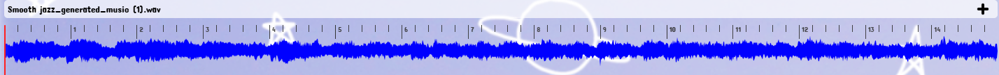
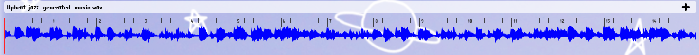

# Mellowdies

## How To Run:

Navigate to the project directory in your command line interface and run the command "npm run dev" in the "mellowdies" folder to run Mellowdies in your default web browser.

## Project Documentation:

### General Information
Members and Roles:
- Jamesline Jeudy (Team Lead/UX Designer)
- Nathan Jones (Scrum Master/Backend Developer)
- Quan Nguyen (Backend Developer)
- Victoria App (Frontend Developer/UX Designer)
- Kevin Yue (Project Manager/Backend Developer)

Advisor: Emmanuel Dorley  
Advisor Email: edorley@ufl.edu

### Abstract

Mellowdies is an innovative real-time audio editing web application for podcasters, musicians, and audio enthusiasts.  This application offers a wide range of features such as applying audio 
effects, trimming, and volume adjustments in addition to an AI music generator, wrapped in a user-friendly and accessible package that can be run in any browser without additional downloads. 
* Keywords: audio, artificial intelligence, editing, user-friendly, accessibility, audio production, audio engineering

### Introduction

The problem that our group set out to solve with this project was manifested by the booming success of the audio streaming industry, where a seemingly countless number of independent music 
artists and podcasters have been able to kickstart their careers by publishing their work independently on platforms such as Spotify and Soundcloud. As the industry has grown, a significant 
challenge has emerged: the high barriers to entering audio production. These obstacles include the steep learning curve of traditional audio editing software, hefty download requirements, high 
costs, and the extensive music theory knowledge aspiring musicians need to succeed in the field.

To provide a solution to this problem, Mellowdies combines AI generation with traditional music editing tools to service both newcomers and veteran music producers from the comforts of their 
browsers. Digital audio workstation (DAW) applications like Bandlab and Descript have made strides by offering a browser-based audio editor and an AI-powered audio generator, respectively. 
However, these solutions often come with drawbacks such as a steep learning curve, financial costs, or a lack of seamless integration with essential tools like AI within the same platform. 
Mellowdies serves as a comprehensive digital audio workstation that builds upon previous DAWs by integrating their best features (various audio editing tools and AI music generation) into a 
free web application that can be easily accessed and utilized to create quality music, regardless of how skilled or experienced the user is at editing and manipulating audio. Our team is 
confident that a solution that builds upon the innovations of previous audio editing breakthroughs while circumventing the stopgaps associated with modern editing software will allow the audio 
streaming industry to get over the “barrier to entry” problem.  

### Problem Domain

The domain in which the problem our group has attempted to solve lies within the area of audio engineering, as our solution to the problem, Mellowdies, is an audio engineering platform that 
provides potential audio engineers with a digital audio workstation that provides them with a variety of modern audio engineering tools to create whatever music, podcasts or other audio samples 
they desire in an environment that is easy to use and understand. In order to develop Mellowdies into a solution that fits within this problem domain, our group has utilized research and tools 
from various resources in the field of audio engineering as well as our own computer science expertise in order to build the best platform possible for the goals we have set out to achieve.

### Literature Review

The number of musicians and podcasters is growing due to how the audio-streaming industry has grown over the last few years. According to Andrea Zarczynski from Forbes [2], there are now 
significantly more independent artists due to music artists' declining record label deals in pursuit of more creativity and ownership of their works. This means that they are taking control of 
their production, which in turn grows the demand for digital audio workstations (DAWs). Recent research from SearchLogistics [3] concluded that the leading platform Spotify has 11 million artists 
and creators who upload on average about 1.8 million new songs every month, which is an all-time high. They also have a growing library of podcast titles - based on an article by Josh Howarth [6], 
the number of new podcasts was up by 202.33% in 2020 with there being around 3.28 million new podcasts up for listening as of 2024. 

When people think of DAWs, they tend to assume only big-shot producers can figure out how to use them. With Mellowdies, we have created a user-friendly interface with all of the features that are 
needed to create whatever the user desires. This brings us to a pertinent question: why should users choose Mellowdies over existing DAWs? 

With Mellowdies, we set out to create a DAW that is an innovative tool for all types of audio editing, not just music. To accomplish this, it will include features such as real-time audio 
editing in the browser, AI audio generation assistance, a user-friendly interface, and optimized presets for a range of audio effects users may be interested in. While other programs have some of 
these features, we have found that they struggle to encompass all of them. For example, Bandlab is free and browser-based, offering a range of editing tools, effects, and access to library loops and 
samples - however, it is tailored more to just musicians rather than the broader scope that we are trying to reach. When it comes to AI integrations, it fails to have AI-driven tools that assist in 
audio editing and it doesn’t have AI generation for specific sounds. Mellowdies seeks to change that by combining the positives of Bandlab with powerful AI audio generation.

If we look at a more AI-driven program such as Descript, we would find that it does have an AI assistant, but it is more podcast-focused and not entirely browser-based. It is user-friendly and 
accessible, but it leaves musicians out of the picture. Auphonic is another AI-powered audio processing tool that can effectively assist its users, but it serves as more of a complement to other 
audio editing tools rather than a full-on DAW. With Mellowdies, we could take what these programs have started and mold it into a more user-friendly all-encompassing DAW. 

Overall, the main issues with all existing solutions are that they either have a steep learning curve, cost money, aren’t browser-based for portability and compatibility, or don’t have fully integrated 
AI-driven tools. Mellowdies takes all these features that musicians, podcasters, and audio engineers alike need and want in a digital audio workspace and puts them into one easy-to-use web application.

### Solution

In order to pose an effective solution to the ‘barrier to entry’ problem plaguing the audio streaming industry, our team designed Mellowdies as a digital audio workstation in the form of a web application. 
We chose to develop our system in the web application format due to the accessibility and reliability of web apps that our team has interacted with through prior experience. Specifically, we’ve found that 
any web application can be freely accessed from a common web browser, and that the market for web applications in today’s world is projected to increase by over 460 million dollars according to projections 
from Grand View Research [8]. With this in mind, we’re confident that a web application-based solution will offer prospective audio engineers with the best possible audio editing functionality at any skill 
level even as audio editing technology continues to progress going forward into the future. 

The technical development of Mellowdies was focused on two major functionality requirements: an audio editing mixer which contains a slate of editing tools that range from basic to advanced levels of 
audio detail, and an artificial intelligence (AI)-based music generator that can modify the characteristics of a given audio sample based on a text prompt written by the system’s user. Both of these 
key features offer merits that are essential to ensuring that Mellowdies is a comprehensive software platform that emphasizes the ease of editing audio with its tools regardless of what type of audio 
sample (music, podcasts, etc.) a user is looking to modify within the platform. While the suite of functions and audio effects present within the audio mixer allow for further refinement and control 
with editing pre-existing audio samples uploaded to Mellowdies, the AI music generation tool can assist users in developing an entirely new audio sample that can then be further refined with the 
mixer functionality; thus allowing both of these key project functionalities work in tandem to form a solution to the “barrier to entry” problem. 

Accessible within the ‘Mixer’ menu on the Mellowdies landing page, the audio editing mixer functionality contains a library of ten different audio effects for users to apply to an audio sample, with 
each effect having its own array of settings that can be adjusted to further refine the change being applied to the user’s sample (for example, the amount of feedback applied to the audio delay effect 
or the specific equalization being applied to the sample at specific Hertz (Hz) values within the ten-band equalizer). While each audio effect has a different impact on the sample being edited, every 
effect operates based on the same foundation: a combination of the Wavesurfer.js library and AudioBuffer class via the framework of the JavaScript language. Wavesurfer.js is an open-source library 
which can render an audio sample into a waveform that can be interacted with through a simple click input. Furthermore, users can click and drag the waveform that a waveSurfer instance creates for 
their audio sample to select a region of their audio to be edited separate from the rest of the sample. On the other hand, AudioBuffer is a class that enables Mellowdies to store the audio sample being 
edited in its own unique audio buffer. In Mellowdies, when a user chooses to apply an audio effect to a section of their sample’s waveform, the system obtains the decoded data of the sample in an audio 
buffer; at this point, Mellowdies clones the buffer as a data backup before utilizing effect-specific methods to manipulate the selected portion of the user’s audio and achieve their desired change. 
If the user is unhappy with their changes, the audio mixer enables them to undo their previous change, redo any changes that had been undone or reset their audio sample back to its original state at 
any point. Additionally, the mixer also allows the user to cut or copy selected regions of their audio sample and paste them over any part of the sample for further editing flexibility. All of these 
features within the mixer functionality ensure that Mellowdies can provide users with several audio editing techniques that are both simple to grasp and effective to use.

The artificial intelligence-based music generation functionality can also be accessed directly from the Mellowdies landing page via the ‘AI Editor’ menu. This feature presents users with multiple 
levels of music generation detail that can be employed in the audio editing process; after providing Mellowdies with a prompt that describes the type of sound they would like the AI to focus on, 
users can choose whether they would like the AI generator to edit a selected portion of their audio sample, edit the entire sample, edit a separate audio file uploaded to Mellowdies from the 
‘AI Editor’ menu, or simply generate a brand new sample based on the user’s prompt. This functionality is made possible through the MusicGen API, an interface containing a single language model 
which enables Mellowdies to “generate high-quality samples… while being conditioned on textual description or melodic features” [5]. Our team decided that MusicGen would be the best model within 
reason to construct the AI generation functionality of our solution due to how well the characteristics of MusicGen aligned with the goals our team set for the development of Mellowdies. As the 
MusicGen study “Simple and Controllable Music Generation” states, the model allows for “better control(s) over the generated output” without overcomplicating the process for users to wield MusicGen 
for their audio editing needs [5], making it a good match for a system designed to combat the ‘barrier to entry’ problem often caused by audio editing software which offers functionality at the cost 
of overall ease of use. This tradeoff, however, is not the case for the MusicGen model: the authors of “Simple and Controllable Music Generation” state throughout their study that the audio samples 
generated by MusicGen adhere to a high quality standard for text-to-music generation. Specifically, the audio generated by MusicGen passes through the model over “several streams of compressed discrete 
music representation” [5] in the form of discrete audio tokens, which the authors then quantify in order to prove the effectiveness of audio samples generated by MusicGen.

The table shown above demonstrates that, when compared to both accepted baselines for audio generation software and other AI audio generation models, MusicGen is able to exhibit strong results in 
three key metrics: the Fréchet Audio Distance (a measure of the how plausible it will be for the generated audio to match a user’s expectations for the sound), the  Kullback-Leiber Divergence 
(an indicator of how well an audio sample edited by AI aligns with the original sample) and the CLAP score (a quantity which determines how effectively AI generated audio aligns with the text 
prompt that creates the AI sample) [5]. Even when variables such as the type of melody and size of the audio tokens assigned to MusicGen change, the model is still able to exhibit a high overall 
average of these metrics, proving that MusicGen excels at generating high-quality audio samples while remaining a simple and controllable application that functions well as part of a digital audio 
workstation such as Mellowdies.

### Results

After completing the development of Mellowdies’ core systems, our team carried out a full-scale testing plan to ensure that our technical solution could fully accomplish all of the functionality 
goals that we had set to overcome the ‘barrier to entry’ problem. Manual unit testing was applied to every single feature within both the ‘AI Editor’ and ‘Mixer’ menus of the web application and 
was very effective in rooting out numerous programming errors that could have prevented users from being able to edit audio samples effectively with our project. Furthermore, our group also conducted 
a static analysis via the SonarCloud code review tool; by connecting to the GitHub repository where our team performed version control on Mellowdies project code, SonarCloud was able to detect potential vulnerabilities in our work and direct us toward issues that we then resolved to ensure that Mellowdies could be fully functional.

The image above is the completed version of our Mellowdies software - the system is able to display the waveform representation of user audio samples perfectly via the Wavesurfer.js integration, 
and users can select any region of the sample to then edit within the ‘AI Editor’ and ‘Mixer’ menus. At any point in the editing process, users can utilize the music player buttons at the bottom 
of the window to navigate to different portions of the sample and listen to the regions of audio that they have edited with the system’s various tools. Once they’ve completed editing their audio 
sample, users can then click the ‘Export’ button in the bottom right corner of the window to download their audio sample for future use.

The three waveforms above show two samples downloaded with the Export feature after being edited with the prompt-based MusicGen AI generation tool to adopt more of a “smooth jazz” and 
“upbeat jazz” sound respectively. Despite being variations of the same base track (which is the first waveform shown above), the visible differences between the waveforms of the two downloaded 
samples demonstrate how Mellowdies is able to accomplish its goal of assisting users to create their own unique audio samples without creating a barrier to entry for users new to the process of 
audio editing or unfamiliar with how a digital audio workstation can be utilized. Our team is confident that the results of our work bode well for how Mellowdies can be used as an effective solution 
to the major accessibility problem plaguing the audio streaming industry going forward.

### Conclusions

Our team has successfully created a feature-complete and functional audio editing web application with a MusicGen AI music generation integration in Mellowdies. It includes common audio editing 
features such as cut, copy and paste in addition to frequently used audio effects like reverb, reverse and delay. Mellowdies also has an intuitive user-interface with region selection, timelines 
and playback control to aid the user during their audio editing work. Finally, the application is integrated with the MusicGen AI music generation model to allow users to generate new audio tracks 
based on their text prompts and/or existing audio files to give them a head start on producing their next audio piece.

Through this project, we have learned that audio production and engineering is an extremely complicated and difficult process that requires a lot of research and refinement in order to produce high 
quality audio tracks that are pleasing and enjoyable for listeners. We have also found during our development that many audio effects and production tools require quite complex, intricate algorithms 
and tight integration in order to be effective and create listenable special effects on audio tracks, making for quite a tumultuous development period. As for the AI generation, we have found that it 
has quite a few drawbacks and limitations. In terms of performance, it requires powerful parallel computing hardware with a lot of memory bandwidth (i.e a high performance GPU like the A10G) to be 
able to generate 15 seconds of audio in about 30 seconds. In terms of quality, the AI generation model is inconsistent as the result’s quality is heavily reliant on the user’s text prompt and how 
related it is to the dataset that the model was trained on.

Even though Mellowdies is quite intuitive and easy to use, it comes at the cost of more advanced features found in desktop Digital Audio Workstation (DAW) softwares such as plugins, automations, 
mixings and multi audio tracks support. We will continue researching the feasibility of implementing these features into our current web application structure. In addition, our AI integration is not 
satisfactory in terms of stability and quality due to our reliance on the MusicGen AI model provided by Meta. Our team is currently considering alternative AI integrations or developing our own AI model 
to better suit our needs and goals.

### Standards & Constraints

* Standards
  * All programming conformed to ECMA-402 standard (commonly referred to as the ECMAScript standard). Version 7.26 of the Babel compiler was employed.
* Constraints
  * The software was developed to run in the browser with all functions being processed in real-time. AI generation is constrained by model GPU processing requirements, and as such is limited
  to 15 seconds of generation after 30 seconds-2 minutes of processing time. GPU used is a demo GPU running on a A10G GPU with 50GB of Ram.

### Acknowledgements

We would like to thank our project advisor Dr. Emmanuel Dorley for keeping our project on track and providing us with valuable feedback and suggestions throughout the semester. We also appreciate Dr. Sanethia Thomas for facilitating this class and providing us an opportunity to work together as a group and pursue our goals. We would like to acknowledge the research and support of Hugging Face models used in projects by Meta researchers Jade Copet and Felix Kreuk.

### References

* [1] A. Russell, “What’s the biggest struggle in music production? A survey of 1000+ producers - EDMPROD,” EDMProd, Feb. 15, 2023. [Online]. Available: https://www.edmprod.com/music-production-struggles/. 
* [2] A. Zarczynski, “As Music Consumption Grows, Independent Artists Crowdsource Creativity,” Forbes, Apr. 4 2022, [Online]. Available: www.forbes.com/sites/andreazarczynski/2022/03/31/as-music-consumption-grows-independent-artists-crowdsource-creativity/. 
* [3] F. Daly and M. Woodward, “Spotify Statistics: Users, Artists, Revenue and More!” SearchLogistics, June 29, 2024. [Online]. Available:  www.searchlogistics.com/learn/statistics/spotify-statistics/#:~:text=Spotify%20has%2082%20million%20songs,share%20between%2032%25%20and%2043%25.
* [4] “How Will AI Impact the Next Generation of Daws? These Developers Have Their Say.” MusicTech. [Online]. Available: musictech.com/features/interviews/ai-daw-digital-audio-workstation-ripx-moises-wavtool/. [Accessed 4 Sept. 2024].
* [5] J. Copet and F. Kreuk, “Simple and Controllable Music Generation,” Huggingface.Co, June 8, 2023. [Online]. Available:  arxiv.org/pdf/2306.05284. 
* [6] J. Howarth, “How Many Podcasts Are There? (New 2024 Data),” Exploding Topics, Feb. 12, 2024. [Online]. Available:  explodingtopics.com/blog/number-of-podcasts.
* [7] M. Clancy, “Mobile audience growth driven by web, not apps: report - mobiForge,” mobiForge, Jan. 26, 2018. [Online]. Available:  https://mobiforge.com/news-comment/mobile-audience-growth-web-not-apps-comscore
* [8] “Progressive Web Apps Market Size, share & Trends analysis Report by component (Platform, Services), by organization size, by application (EMedia & Entertainment, Banking & Financial Services), by region, and segment Forecasts, 2024 - 2030.” [Online]. Available: https://www.grandviewresearch.com/industry-analysis/progressive-web-apps-pwa-market-report
